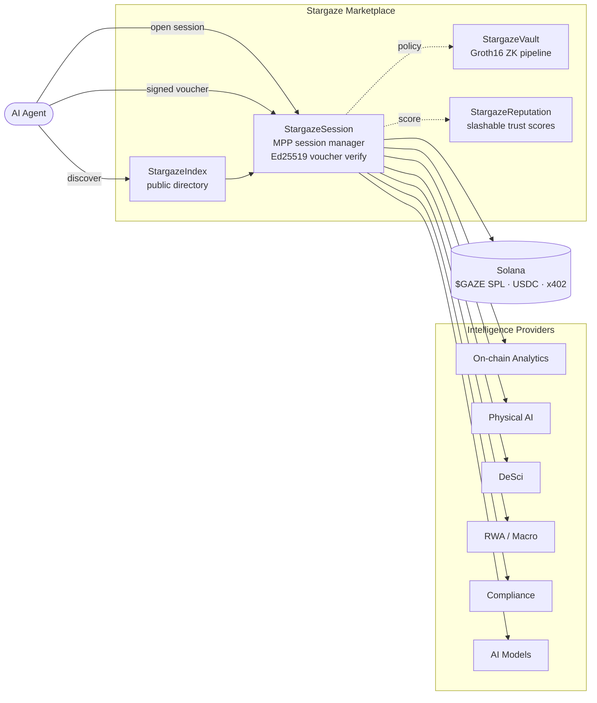
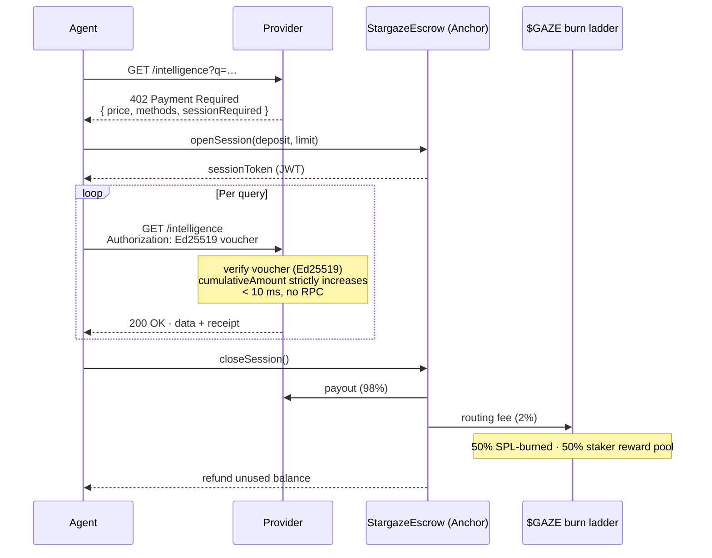

<div align="center">

# StargazeMPP

**The intelligence marketplace for the agentic economy.**

Discover, access, and pay for on-chain intelligence in a single HTTP request cycle. No accounts. No API keys. No KYC. Built natively on the Machine Payments Protocol — Solana-native.

[](#license)
[](https://stripe.com/mpp)
[](https://solana.com)
[](https://pump.fun)
[](https://www.typescriptlang.org)
[](https://www.rust-lang.org)
[](https://www.anchor-lang.com)

[Overview](#overview) · [Architecture](#architecture) · [Quick Start](#quick-start) · [Packages](#packages) · [Documentation](#documentation) · [Roadmap](#roadmap) · [Security](#security)

</div>

---

## Overview

StargazeMPP is the discovery, settlement, reputation, and privacy layer for the [Machine Payments Protocol](https://stripe.com/mpp) (MPP) — the IETF-track HTTP 402 standard, jointly launched by Stripe and Tempo, that makes machine-to-machine payments a first-class operation on the open web.

Providers register intelligence services. AI agents query a public directory to discover what exists and at what price. A single signed session lets one agent stream queries to many providers, with sub-100-millisecond verification and a single on-chain settlement on close. Privacy-sensitive workloads (medical cohort aggregates, geofence attestations, raw drone telemetry) sit behind Groth16-proven vaults — agents receive a verifiable answer without ever seeing the underlying data. Providers that ship bad responses lose their `$GAZE` stake.

The marketplace settles on a single chain: USDC on Solana via the x402 receipt format, with Stripe, Visa, and Lightning on-ramps funding the agent's Solana wallet before a session opens. `$GAZE` is the Solana SPL launched on pump.fun — staked by providers, slashable on bad behaviour, burned on routing fees and reputation votes.

## Key Features

- **Single-request economics.** Agents pay per query at sub-100-millisecond latency. No subscriptions, no account creation, no API key rotation.
- **Wallet-as-identity.** Ed25519-signed vouchers replace API keys; the agent's Solana pubkey is the only identity that crosses the wire.
- **Solana-native settlement.** USDC via the x402 receipt format; fiat on-ramps via Stripe, Visa, and Lightning land funds straight in the agent's Solana wallet.
- **Privacy by construction.** Four privacy tiers — `open`, `zk-aggregate`, `confidential`, `buyer-key` — with Groth16 verifiers wired into a per-provider registry on-chain.
- **Slashable reputation.** Provider `$GAZE` stake is forfeit on SLA breach or response fraud — stake escrow is on Solana, slashing is admin-gated. Reputation scoring is crowd-verified and cross-checked by an automated oracle.
- **Sub-10 millisecond voucher verification.** Pure-crypto path: Ed25519 against a cumulative voucher, with strict monotonicity enforced on-chain.
- **Six intelligence categories.** On-chain analytics, physical-AI telemetry, decentralised science, real-world-asset macro signals, compliance attestations, and AI model endpoints.

## Architecture



The four service layers sit on top of the MPP primitive. The Solana Anchor program owns everything on-chain: session escrow with cumulative-amount voucher settlement, the provider registry, the per-provider Groth16 vault config, slashable reputation scores, and the `$GAZE` token economy (stake/unstake with cooldown, slashing, and the routing-fee burn ladder against the pump.fun-launched SPL). A Yellowstone-gRPC Rust indexer projects on-chain events into a TimescaleDB-backed warehouse with sub-50-millisecond lag.

### Request Lifecycle



## Quick Start

### Prerequisites

| Tool | Version | Used by |
|---|---|---|
| Node | ≥ 20 | TypeScript packages, indexer scripts |
| Rust (`cargo`) | ≥ 1.95 | Anchor program, indexer |
| Anchor CLI | ≥ 0.31 | Solana program |
| Solana CLI | ≥ 3.1 | Devnet / mainnet interaction |
| circom | ≥ 2.1 | Vault circuits |
| Docker | latest | Local Postgres + TimescaleDB + Redis |

### Clone & install

```bash
git clone https://github.com/StargazeMPP/StargazeMPP.git
cd StargazeMPP
npm install
```

### Build everything

```bash
# TypeScript packages
npm run build --workspaces --if-present

# Solana program
cd packages/anchor-program
anchor build

# Indexer
cd ../indexer
cargo build --release

# Vault circuit (aggregate sum)
cd ../vault-circuits
npm run compile:aggregate
```

### Run the test suites

The unified gate is the top-level Makefile:

```bash
make check        # anchor build + every cargo test + every vitest + every tsc
make check-fast   # same minus anchor build (inner-loop iteration)
make help         # list every sub-target
```

Individual stacks are available too:

```bash
anchor test                                         # Solana
cargo test --workspace                              # Rust crates
npm test --workspace @stargazempp/shared            # Shared types
npm test --workspace @stargazempp/provider-sdk      # Provider SDK
```

## Packages

| Package | Description |
|---|---|
| [`@stargazempp/shared`](packages/shared) | Cross-package types, schemas, IDL, and ABIs. Voucher domain, JWT session claims, `MppVerifier` + `VaultProofGenerator` interfaces, USDC mint constants, and category enum. |
| [`@stargazempp/provider-sdk`](packages/provider-sdk) | Decorator-style SDK for monetising any HTTP endpoint as an MPP intelligence service. Includes the reference `StargazeMppVerifier` (sub-10 ms voucher recovery), x402 receipt parser, and Solana deposit verification. |
| [`@stargazempp/anchor-program`](packages/anchor-program) | `StargazeAnchor` program on Solana — provider registry, session escrow, voucher settlement, reputation scoring, x402 receipt PDA, per-provider vault config, and the `$GAZE` SPL token economy: stake/unstake with cooldown, slashing, and the routing-fee burn ladder. `$GAZE` itself launches on pump.fun as a standard SPL. |
| [`@stargazempp/stargaze-events`](packages/stargaze-events) | Standalone Anchor event decoder (Rust). Path-depended by the indexer and the anchor-program test suite. |
| [`@stargazempp/indexer`](packages/indexer) | Rust + Yellowstone gRPC indexer for `StargazeAnchor` events and x402 USDC receipts. Projects into Postgres / TimescaleDB. Sub-50-millisecond lag target. |
| [`@stargazempp/vault-circuits`](packages/vault-circuits) | Groth16 circuits (snarkjs / circom) and on-chain verifier programs for the StargazeVault privacy tiers (`aggregate-sum`, `aggregate-mean`, `geofence`). |
| [`@stargazempp/reputation-oracle`](packages/reputation-oracle) | TS service that ingests `ReputationVoted` events from the indexer's Postgres projection, aggregates per-provider scores, and writes back via `setReputationScore` on-chain. |
| [`@stargazempp/frontend`](packages/frontend) | Next.js 16 (App Router, Turbopack, RSC) marketplace front-end — Fraunces / Inter Tight / JetBrains Mono brand. |
| [`@stargazempp/backend`](packages/backend) | Express 5 + tRPC 11 API gateway, StargazeIndex Service, MPP Session Manager. |

## Tech Stack

**On-chain.** Anchor 0.31 (Solana), Groth16 + snarkjs + circom for ZK, on-chain verifier programs for the vault tiers.

**Off-chain.** Express 5, tRPC 11, Drizzle ORM, PostgreSQL + TimescaleDB, Redis, elizaOS v2 for the Reputation Oracle, Claude API for AI-assisted quality assessment, Rust + Tokio + Yellowstone gRPC for the indexer.

**Front-end.** Next.js 16 (App Router, Turbopack, React Server Components), React 19.2, Tailwind CSS 4, shadcn/ui primitives, Fraunces / Inter Tight / JetBrains Mono.

**Settlement.** USDC on Solana via x402; fiat on-ramps through Stripe / Visa / Lightning fund the agent's Solana wallet.

## Documentation

| Doc | Topic |
|---|---|
| [`SECURITY.md`](SECURITY.md) | On-chain trust model + invariants per surface (escrow, staking, vault registry, vault proof, Ed25519 / Groth16 crypto). Anchor companion to the Trail of Bits engagement. |
| [`docs/vault-verifier-deployment.md`](docs/vault-verifier-deployment.md) | Build + deploy + register flow for the three Groth16 verifier programs; per-provider `configure_vault` registration; SDK example. |
| [`docs/vault-ceremony.md`](docs/vault-ceremony.md) | Trusted-setup ceremony plan (Phase 1 reuse, per-circuit Phase 2 contributor rotation, attestation format). |
| [`packages/anchor-program/BENCH.md`](packages/anchor-program/BENCH.md) | Recorded compute-unit numbers for `settle` and `submit_vault_proof`. |

## Roadmap

| Phase | Window | Headline |
|---|---|---|
| 1 — Index + Session | Weeks 1–8 | Public directory live; ten launch providers; Solana session end-to-end. |
| 2 — Vault + Physical AI | Weeks 9–18 | Groth16 privacy wrapper live; drone and robot telemetry registered; 10,000 queries / day. |
| 3 — Audit + Pump.fun launch + AI Models | Weeks 19–26 | Trail of Bits audit closed; `$GAZE` SPL launches on pump.fun; 100,000 queries / day. |
| 4 — Enterprise + Reputation Oracle | Weeks 27–36 | Crowd-verified reputation in production; enterprise bulk sessions; 1M queries / day. |
| 5 — Full agentic economy | Month 10+ | 1,000+ providers; $1M+ USDC routed per month. |

## Security

- **Invariants.** Per-surface invariants for escrow, staking, vault registry, vault proof, and the Ed25519 / Groth16 cryptographic boundaries are enumerated in [`SECURITY.md`](SECURITY.md).
- **Audits.** Trail of Bits is engaged for the Anchor program and Groth16 verifier programs prior to mainnet. Certora is engaged for formal verification of escrow + voucher-settlement invariants.
- **Bug bounty.** Listed on Immunefi from launch — $200K critical (escrow drain), $50K high.
- **Disclosure.** Report vulnerabilities privately to the operator; coordinated disclosure within 90 days unless an immediate fix would compromise users. Do not file public GitHub issues for security bugs.
- **Upgrade authority.** The Anchor program upgrade authority sits behind a 4-of-7 Solana multisig with a 14-day timelock on every upgrade. Per-circuit verifier programs are intended to be marked immutable before mainnet activation — see [`docs/vault-verifier-deployment.md`](docs/vault-verifier-deployment.md).

## Contributing

Pull requests welcome. See [`CONTRIBUTING.md`](CONTRIBUTING.md) for the workflow, code-review expectations, and how the boundary types in `@stargazempp/shared` are governed.

## License

Apache License 2.0 — see [`LICENSE`](LICENSE). The MPP specification itself is published under Apache 2.0 by Stripe and Tempo; this project follows suit.

## Acknowledgments

Built on top of work by Stripe, Tempo, Paradigm, the Solana Foundation, Coinbase (x402), Light Protocol (ZK geofence), and the wider Anchor, snarkjs, and TanStack communities.
