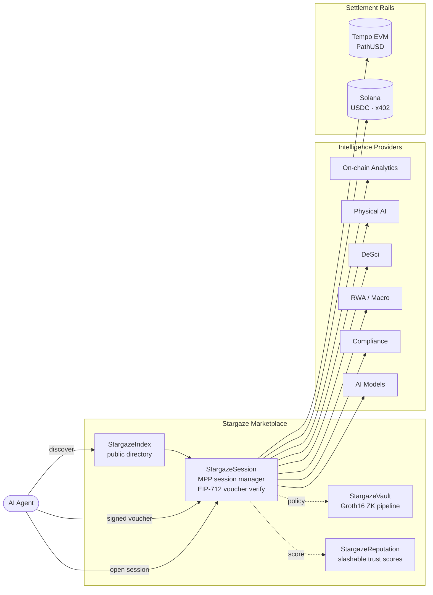
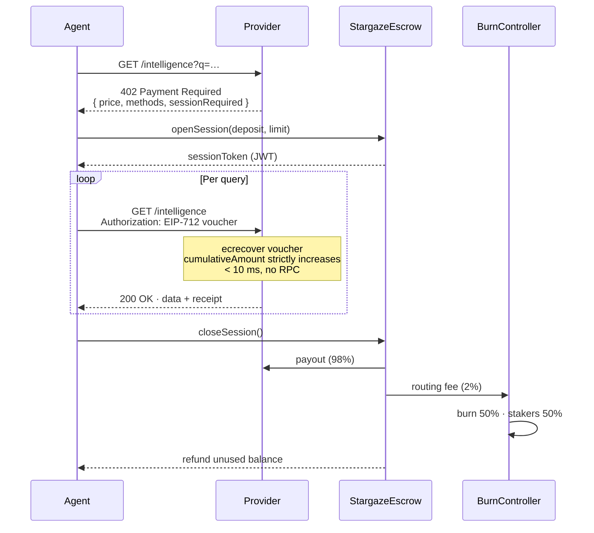

<div align="center">

# StargazeMPP

**The intelligence marketplace for the agentic economy.**

Discover, access, and pay for on-chain intelligence in a single HTTP request cycle. No accounts. No API keys. No KYC. Built natively on the Machine Payments Protocol.

[](#license)
[](https://stripe.com/mpp)
[-8b5cf6.svg)](https://tempo.xyz)
[](https://solana.com)
[](https://www.typescriptlang.org)
[](https://soliditylang.org)
[](https://www.rust-lang.org)
[](https://www.anchor-lang.com)

[Overview](#overview) · [Architecture](#architecture) · [Quick Start](#quick-start) · [Packages](#packages) · [Documentation](#documentation) · [Roadmap](#roadmap) · [Security](#security)

</div>

---

## Overview

StargazeMPP is the discovery, settlement, reputation, and privacy layer for the [Machine Payments Protocol](https://stripe.com/mpp) (MPP) — the IETF-track HTTP 402 standard, jointly launched by Stripe and Tempo, that makes machine-to-machine payments a first-class operation on the open web.

Providers register intelligence services. AI agents query a public directory to discover what exists and at what price. A single signed session lets one agent stream queries to many providers, with sub-100-millisecond verification and a single on-chain settlement on close. Privacy-sensitive workloads (medical cohort aggregates, geofence attestations, raw drone telemetry) sit behind Groth16-proven vaults — agents receive a verifiable answer without ever seeing the underlying data. Providers that ship bad responses lose their `$GAZE` stake.

The marketplace settles dual-rail across two chains: PathUSD on Tempo EVM for the canonical MPP path, and USDC on Solana via the x402 receipt format. Stripe, Visa, and Lightning on-ramps make the same intelligence reachable from any agent runtime.

## Key Features

- **Single-request economics.** Agents pay per query at sub-100-millisecond latency. No subscriptions, no account creation, no API key rotation.
- **Wallet-as-identity.** EIP-712 vouchers replace API keys; the agent's wallet address is the only identity that crosses the wire.
- **Dual-rail settlement.** Tempo PathUSD and Solana USDC (x402) are interchangeable at the session boundary; fiat on-ramps via Stripe, Visa, and Lightning.
- **Privacy by construction.** Four privacy tiers — `open`, `zk-aggregate`, `confidential`, `buyer-key` — with on-chain Groth16 verifiers wired into a per-provider registry.
- **Slashable reputation.** Provider stake is forfeit on SLA breach or response fraud; reputation scoring is crowd-verified and cross-checked by an automated oracle.
- **Sub-10 millisecond voucher verification.** Pure-crypto path: `ecrecover` against a cumulative EIP-712 voucher, with strict monotonicity enforced on-chain.
- **Six intelligence categories.** On-chain analytics, physical-AI telemetry, decentralised science, real-world-asset macro signals, compliance attestations, and AI model endpoints.

## Architecture



The four service layers sit on top of the MPP primitive. Smart contracts on Tempo EVM hold escrow, mint and burn the `$GAZE` coordination token, register providers, and store reputation scores. A mirror Anchor program on Solana extends the registry to Solana-native providers and persists x402 receipts. A Yellowstone-gRPC Rust indexer projects on-chain events into a TimescaleDB-backed warehouse with sub-50-millisecond lag.

### Request Lifecycle



## Quick Start

### Prerequisites

| Tool | Version | Used by |
|---|---|---|
| Node | ≥ 20 | TypeScript packages, indexer scripts |
| Foundry (`forge`) | ≥ 1.5 | EVM contracts |
| Rust (`cargo`) | ≥ 1.95 | Anchor program, indexer |
| Anchor CLI | ≥ 0.31 | Solana program |
| Solana CLI | ≥ 3.1 | Devnet / mainnet interaction |
| circom | ≥ 2.1 | Vault circuits |
| Docker | latest | Local Postgres + TimescaleDB + Redis |

### Clone & install

```bash
git clone https://github.com/StargazeMPP/StargazeMPP.git
cd StargazeMPP
npm install
```

### Build everything

```bash
# TypeScript packages
npm run build --workspaces --if-present

# EVM contracts
cd packages/contracts-evm
forge install
forge build
forge test

# Solana program
cd ../anchor-program
anchor build

# Indexer
cd ../indexer
cargo build --release

# Vault circuit (aggregate sum)
cd ../vault-circuits
npm run compile:aggregate
```

### Run the test suites

```bash
forge test                                          # EVM
anchor test                                         # Solana
cargo test --workspace                              # Rust crates
npm test --workspace @stargazempp/shared            # Shared types
npm test --workspace @stargazempp/provider-sdk      # Provider SDK
```

## Packages

| Package | Description |
|---|---|
| [`@stargazempp/shared`](packages/shared) | Cross-package types, schemas, ABIs, and IDL. EIP-712 voucher domain, JWT session claims, `MppVerifier` + `VaultProofGenerator` interfaces, USDC mint constants, and category enum. |
| [`@stargazempp/provider-sdk`](packages/provider-sdk) | Decorator-style SDK for monetising any HTTP endpoint as an MPP intelligence service. Includes the reference `StargazeMppVerifier` (sub-10 ms voucher recovery via viem). |
| [`@stargazempp/contracts-evm`](packages/contracts-evm) | Solidity contracts deployed to Tempo EVM: `GAZEToken`, `BurnController`, `StargazeEscrow`, `StargazeRegistry`, `PrivacyVaultRegistry`. Foundry-based, via-IR + optimizer enabled, 4-of-7 Safe multisig upgrade authority planned. |
| [`@stargazempp/anchor-program`](packages/anchor-program) | `StargazeAnchor` program on Solana — Solana-side provider registry, x402 receipt PDA, and CCIP-mirrored reputation. |
| [`@stargazempp/indexer`](packages/indexer) | Rust + Yellowstone gRPC indexer for `StargazeAnchor` events and x402 USDC receipts. Sub-50-millisecond lag target. |
| [`@stargazempp/vault-circuits`](packages/vault-circuits) | Groth16 circuits (snarkjs / circom) and on-chain verifier contracts for the StargazeVault privacy tiers. Trusted-setup ceremony coordination in [`docs/vault-ceremony.md`](docs/vault-ceremony.md). |
| [`@stargazempp/frontend`](packages/frontend) | TanStack Start + shadcn/ui marketplace front-end. |
| [`@stargazempp/backend`](packages/backend) | Express 5 + tRPC 11 API gateway, StargazeIndex Service, MPP Session Manager, Reputation Oracle. |

## Tech Stack

**On-chain.** Solidity 0.8.27 (Tempo EVM), Anchor 0.31 (Solana), Chainlink CCIP for cross-chain mirroring, Groth16 + snarkjs + circom for ZK, Foundry for EVM tooling.

**Off-chain.** Express 5, tRPC 11, Drizzle ORM, PostgreSQL + TimescaleDB, Redis, elizaOS v2 for the Reputation Oracle, Claude API for AI-assisted quality assessment, Rust + Tokio + Yellowstone gRPC for the indexer.

**Front-end.** TanStack Start, React, shadcn/ui, Tailwind CSS.

**Settlement rails.** Tempo PathUSD (native), Solana USDC via x402, fiat on-ramps through Stripe / Visa / Lightning.

## Roadmap

| Phase | Window | Headline |
|---|---|---|
| 1 — Index + Session | Weeks 1–8 | Public directory live; ten launch providers; Tempo + Solana session end-to-end. |
| 2 — Vault + Physical AI | Weeks 9–18 | Groth16 privacy wrapper live; drone and robot telemetry registered; 10,000 queries / day. |
| 3 — Audit + TGE + AI Models | Weeks 19–26 | Trail of Bits audit closed; `$GAZE` token generation event; 100,000 queries / day. |
| 4 — Enterprise + CCIP | Weeks 27–36 | Chainlink CCIP cross-chain provider registry; enterprise bulk sessions; 1M queries / day. |
| 5 — Full agentic economy | Month 10+ | 1,000+ providers; $1M+ PathUSD routed per month. |

## Documentation

- [`docs/overview.pdf`](docs/overview.pdf) — Product overview and market context.
- [`docs/backend.pdf`](docs/backend.pdf) — Backend infrastructure specification.
- [`docs/vault-ceremony.md`](docs/vault-ceremony.md) — Groth16 trusted-setup ceremony plan.

## Security

- **Audits.** Trail of Bits is engaged for the EVM contracts and Groth16 verifier contracts prior to mainnet. Certora is engaged for formal verification of the `GAZEToken` transfer hook.
- **Bug bounty.** Listed on Immunefi from launch — $200K critical (escrow drain), $50K high.
- **Disclosure.** Send vulnerability reports to `security@stargazempp.com` (PGP key in [`SECURITY.md`](SECURITY.md)). Coordinated disclosure within 90 days unless an immediate fix would compromise users.
- **Upgrade authority.** Every Tempo EVM contract sits behind a 4-of-7 Safe multisig with a 14-day timelock on every upgrade.

## Contributing

Pull requests welcome. See [`CONTRIBUTING.md`](CONTRIBUTING.md) for the workflow, code-review expectations, and how the boundary types in `@stargazempp/shared` are governed.

## License

Apache License 2.0 — see [`LICENSE`](LICENSE). The MPP specification itself is published under Apache 2.0 by Stripe and Tempo; this project follows suit.

## Acknowledgments

Built on top of work by Stripe, Tempo, Paradigm, the Solana Foundation, Coinbase (x402), Chainlink (CCIP), Light Protocol (ZK geofence), OpenZeppelin, and the wider Foundry, Anchor, and TanStack communities.
